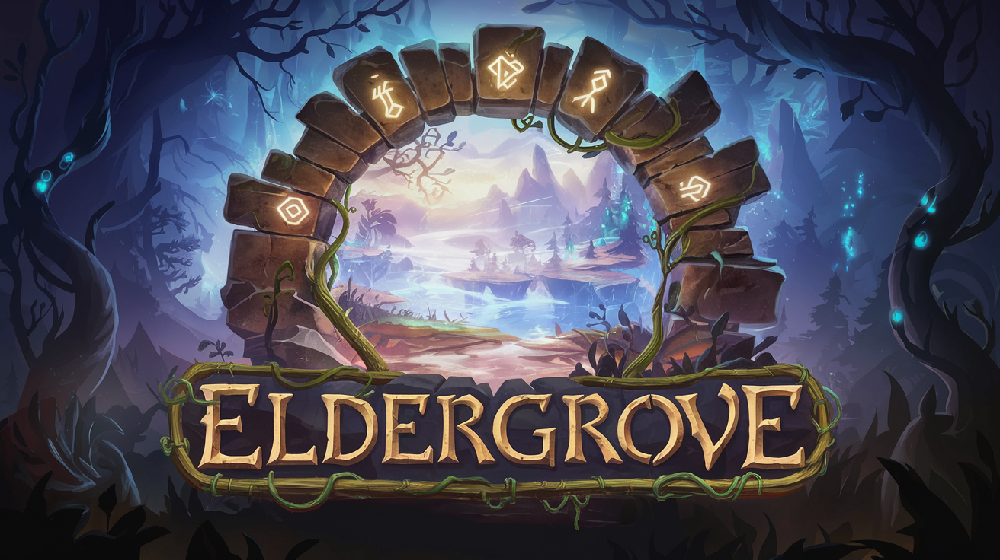

# Eldergrove



**Eldergrove** is a fantasy roguelike engine built in C# using GoRogue, SadConsole, and NLua for scripting. It allows players to explore a procedurally generated world filled with creatures, magic, and limitless adventure. The game engine is designed to provide an immersive experience that serves as an escape into a fantastical realm, where players can shape and evolve the world around them.

## Features
- Procedurally generated maps and worlds.
- Tile-based rendering with **SadConsole**.
- Dynamic scripting using **Jint** for customizing game logic.
- A rich, evolving world filled with creatures, NPCs, and adventure.


## Motivation

Eldergrove was born from a desire to create a personal escape into a world of fantasy. Inspired by the immersive nature of works like Terry Brooks' *Landover*, the goal is to craft a place where you can retreat and explore freely, away from the demands of everyday life. This engine is designed to generate a living, breathing world that evolves over time, filled with creatures, magic, and endless possibilities.

What sets Eldergrove apart is the focus on creating not just a game, but a customizable engine that allows users to shape their own unique experiences. With procedurally generated maps, dynamic scripting, and the potential to expand with new content, Eldergrove aims to offer a rich, evolving universe that can be tailored to your vision of adventure and exploration.


## License
This project is licensed under the MIT License. See the [LICENSE](LICENSE.md) file for more details.


## Getting Started

To get started with Eldergrove, clone this repository and explore the core functionalities, or build your own custom world using the provided tools.

```bash
git clone https://github.com/tgiachi/eldergrove.git
cd eldergrove
dotnet restore
dotnet run
```
